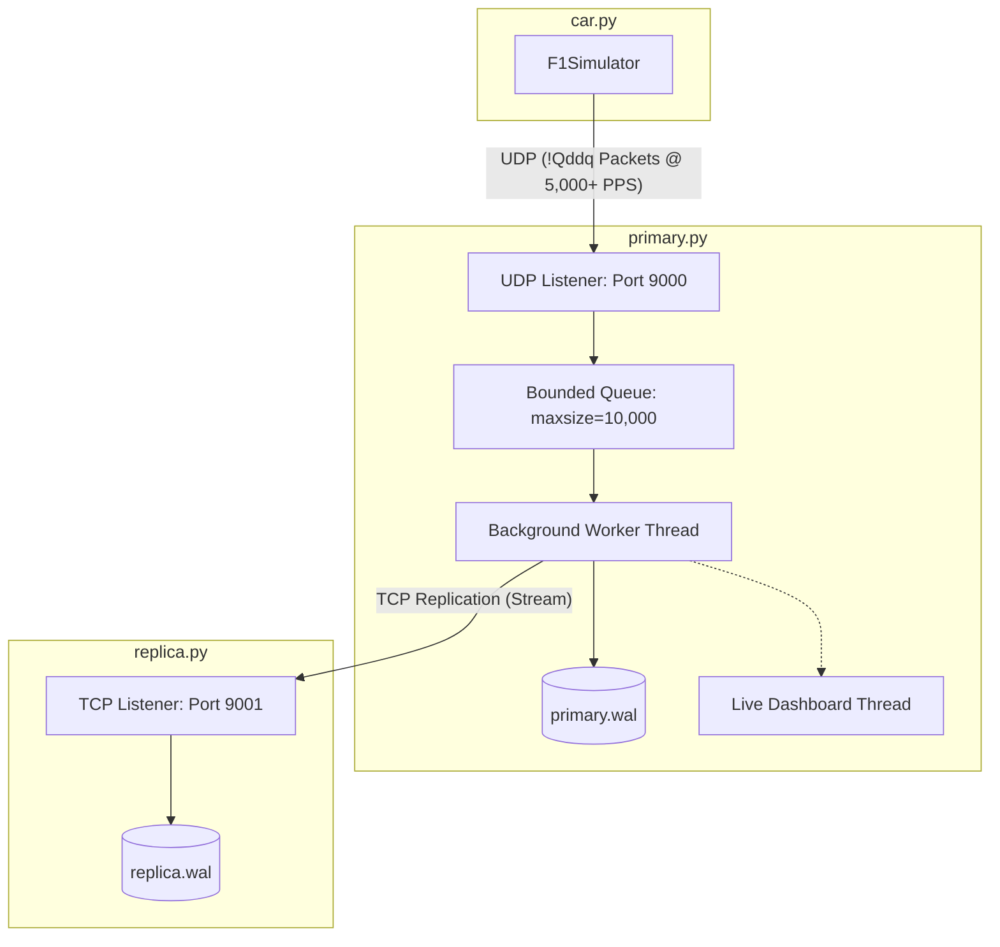

# Fault-Tolerant F1 Telemetry Engine

A high-performance, fault-tolerant telemetry storage engine built in pure Python (standard library only) to ingest a firehose of binary sensor data from a simulated Formula 1 car, persist it durably, and replicate it in real-time to a backup node.

## Architecture Diagram



## WAL + Replication in Crash Recovery

Write-Ahead Logging (WAL) guarantees durability by appending incoming binary telemetry packets directly to a persistent, append-only disk log (`primary.wal`) and forcing an operating system flush (`os.fsync`) before confirming transmission or queuing. In the event of a primary node crash, the WAL acts as the local source of truth, ensuring that any acknowledged telemetry packets survive the crash intact. Real-time replication extends this durability by streaming these committed byte chunks over a TCP connection to a backup node (`replica.wal`), creating a hot replica. Since every 32-byte packet contains a monotonically increasing sequence number, the replica and primary can seamlessly handle disconnections: on reconnect, the replica performs an $O(1)$ disk seek to read its last sequence number, sends a handshake to the primary, and the primary resumes replication from that precise byte offset. This combination eliminates data duplication, avoids gap loss, and allows immediate quantification of the Recovery Point Objective (RPO) down to the millisecond.

---

## Verbatim Validation Output (Zero Data Loss)

Below is the verbatim output from `validate.py` illustrating perfect replication alignment and zero data loss on a mid-race primary crash:

```text
════════════════════════════════════════════════════════════
  F1 TELEMETRY ENGINE — CRASH RECOVERY VALIDATOR
════════════════════════════════════════════════════════════

▶  Loading WAL files...
  Primary WAL : 43,600 packets  (1.33 MB)
  Replica WAL : 43,600 packets  (1.33 MB)

▶  Checking sequence number integrity...
  ✓  Seq numbers are strictly monotonic in both WALs.

▶  Verifying replica is a valid prefix of primary...
  ✓  Replica matches primary perfectly up to packet 43599.

▶  Crash boundary analysis...
  ✓  Zero data loss. Replica is fully caught up.

▶  Last telemetry reading (primary WAL):
  Seq#    : 43,600
  Speed   : 164.2 km/h
  RPM     : 12,113
  Time    : 11:26:14.926

  Validation completed in 208.1 ms.
════════════════════════════════════════════════════════════
```
